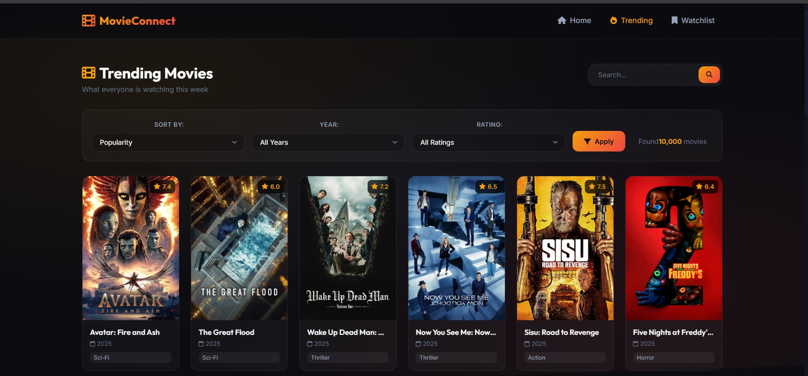

< | Complete feature overview |
| [🖼️ Screenshots](#️-screenshots) | Visual showcase |
| [🏗️ Architecture](#️-architecture) | Project structure |
| [🎨 Design System](#-design-system) | UI/UX components |
| [🧩 Components](#-components-deep-dive) | Detailed component breakdown |
| [⚙️ Technology](#️-technology-stack) | Tech stack used |
| [🚀 Getting Started](#-getting-started) | Installation guide |
| [📖 API Reference](#-api-reference) | TMDb API integration |
| [🤝 Contributing](#-contributing) | How to contribute |
| [👨‍💻 Author](#-author) | Creator information |

</div>

---

## ✨ Features

<div align="center">

### 🌟 Core Functionality

</div>

<table>
<tr>
<td width="50%">

### 🔍 **Intelligent Search**
- Real-time autocomplete with movie suggestions
- Quick search shortcuts for popular franchises
- Mini search bar for seamless browsing
- Keyboard navigation support (Arrow keys + Enter)

</td>
<td width="50%">

### 🔥 **Trending Movies**
- Weekly trending carousel with horizontal scroll
- Ranking system (#1, #2, #3...)
- Backdrop images with gradient overlays
- Hover effects with play button animations

</td>
</tr>
<tr>
<td width="50%">

### 🏷️ **Genre Exploration**
- 18 genre categories with unique icons
- Interactive pill-style genre buttons
- Filtered movie grid by genre
- Smooth transitions and hover states

</td>
<td width="50%">

### 📌 **Personal Watchlist**
- Add/remove movies with one click
- Persistent localStorage storage
- Badge counter in navigation
- Quick actions on movie cards

</td>
</tr>
<tr>
<td width="50%">

### 🎬 **Detailed Movie Modal**
- Full movie information display
- Cast members with profile pictures
- Director, budget, and revenue details
- YouTube trailer integration

</td>
<td width="50%">

### ⭐ **Reviews & Ratings**
- 5-star interactive rating system
- Personal review text area
- Local storage persistence
- Instant save functionality

</td>
</tr>
<tr>
<td width="50%">

### 🔄 **Advanced Filtering**
- Sort by popularity, rating, date
- Year filter (1900 - Present)
- Rating filter (6+, 7+, 8+, 9+ stars)
- Combined filter application

</td>
<td width="50%">

### 📱 **Responsive Design**
- Mobile-first approach
- Adaptive grid layouts
- Touch-optimized interactions
- Cross-device compatibility

</td>
</tr>
</table>

---

## 🖼️ Screenshots

<div align="center">

### 🏠 Homepage View
*Featuring hero section with animated gradient background, search functionality, and trending carousel*


---

### 🔥 Trending Page
*Dedicated trending movies page with filters and pagination*



</div>

---

## 🏗️ Architecture

```
MovieConnect/
│
├── 📄 index.html          # Main HTML structure (448 lines)
│   ├── Navbar component
│   ├── Hero section with search
│   ├── Trending carousel
│   ├── Genre pills section
│   ├── Movie grid & filters
│   ├── Movie detail modal
│   ├── Video modal (trailers)
│   ├── Toast notifications
│   └── Footer component
│
├── 🎨 style.css           # Premium design system (3245 lines)
│   ├── CSS Variables/Tokens
│   ├── Base styles & reset
│   ├── Typography system
│   ├── All component styles
│   ├── Animations & keyframes
│   └── Responsive breakpoints
│
└── ⚡ script.js           # Application logic (1247 lines)
    ├── Configuration & state
    ├── Event listeners
    ├── API integrations
    ├── UI manipulations
    └── Utility functions
```

---

## 🎨 Design System

<div align="center">

### 🎨 Color Palette

</div>

<table align="center">
<tr>
<th>Purpose</th>
<th>Color</th>
<th>Value</th>
<th>Usage</th>
</tr>
<tr>
<td>🌑 Primary Background</td>
<td></td>
<td><code>#0a0a0f</code></td>
<td>Main background</td>
</tr>
<tr>
<td>🌒 Secondary Background</td>
<td></td>
<td><code>#12121a</code></td>
<td>Cards, modals</td>
</tr>
<tr>
<td>🌓 Tertiary Background</td>
<td></td>
<td><code>#1a1a2e</code></td>
<td>Elevated elements</td>
</tr>
<tr>
<td>🔶 Primary Accent</td>
<td></td>
<td><code>#f59e0b</code></td>
<td>CTAs, highlights</td>
</tr>
<tr>
<td>🔴 Secondary Accent</td>
<td></td>
<td><code>#ef4444</code></td>
<td>Gradients, alerts</td>
</tr>
<tr>
<td>✅ Success</td>
<td></td>
<td><code>#10b981</code></td>
<td>Success states</td>
</tr>
<tr>
<td>🔵 Info</td>
<td></td>
<td><code>#3b82f6</code></td>
<td>Information</td>
</tr>
</table>

---

### 🔤 Typography

<table align="center">
<tr>
<th>Font Family</th>
<th>Usage</th>
<th>Weights</th>
</tr>
<tr>
<td><b>Outfit</b></td>
<td>Display text, headings, titles</td>
<td>400, 500, 600, 700, 800</td>
</tr>
<tr>
<td><b>Inter</b></td>
<td>Body text, paragraphs, UI elements</td>
<td>300, 400, 500, 600, 700, 800, 900</td>
</tr>
</table>

---

### 📐 Spacing System

```css
--spacing-xs:   0.25rem  /*  4px */
--spacing-sm:   0.5rem   /*  8px */
--spacing-md:   1rem     /* 16px */
--spacing-lg:   1.5rem   /* 24px */
--spacing-xl:   2rem     /* 32px */
--spacing-2xl:  3rem     /* 48px */
--spacing-3xl:  4rem     /* 64px */
```

---

### 🔲 Border Radius

```css
--radius-sm:    8px      /* Buttons, inputs */
--radius-md:    12px     /* Cards */
--radius-lg:    16px     /* Modals */
--radius-xl:    24px     /* Hero elements */
--radius-full:  9999px   /* Pills, badges */
```

---

## 🧩 Components Deep Dive

<details>
<summary><h3>🧭 Navigation Bar</h3></summary>

The navbar features a **glassmorphism design** with backdrop blur and transparency.

#### Features:
- **Fixed positioning** - Always visible at the top
- **Scroll detection** - Adds shadow when scrolled
- **Gradient logo** - Animated brand with film icon
- **Mobile hamburger menu** - Collapsible on smaller screens
- **Active state indicators** - Highlights current page
- **Watchlist badge** - Dynamic counter with gradient background

```html
<nav class="navbar" id="navbar">
    <div class="navbar-container">
        <a href="#" class="navbar-brand">
            <i class="fas fa-film"></i>
            <span>MovieConnect</span>
        </a>
        <ul class="navbar-nav">
            <li><a href="#" class="nav-link active">Home</a></li>
            <li><a href="#" class="nav-link">Trending</a></li>
            <li>
                <a href="#" class="nav-link">
                    Watchlist
                    <span class="badge" id="watchlistCount">0</span>
                </a>
            </li>
        </ul>
    </div>
</nav>
```

</details>

<details>
<summary><h3>🦸 Hero Section</h3></summary>

A visually striking hero section with **animated gradients** and a central search experience.

#### Features:
- **Animated background** - Radial gradients with subtle rotation
- **Noise texture overlay** - Subtle SVG noise for depth
- **Hero badge** - "Discover • Watch • Enjoy" pill
- **Gradient text** - "Favorite" word with accent gradient
- **Large search bar** - Central focus element
- **Quick action buttons** - Marvel, Star Wars, Harry Potter, Batman

```css
body::before {
    background:
        radial-gradient(ellipse at 20% 20%, rgba(245, 158, 11, 0.08) 0%, transparent 50%),
        radial-gradient(ellipse at 80% 80%, rgba(239, 68, 68, 0.08) 0%, transparent 50%),
        radial-gradient(ellipse at 50% 50%, rgba(59, 130, 246, 0.05) 0%, transparent 50%);
    animation: bgShift 20s ease-in-out infinite alternate;
}
```

</details>

<details>
<summary><h3>🔍 Search System</h3></summary>

An intelligent search system with **real-time autocomplete**.

#### Features:
- **Debounced input** - 300ms delay to reduce API calls
- **Autocomplete dropdown** - Shows top 6 results with posters
- **Keyboard navigation** - Arrow up/down to select, Enter to confirm
- **Instant search** - Click or press Enter to search
- **Mini search bar** - Persistent search on results page

```javascript
const CONFIG = {
    debounceDelay: 300,
    // ...
};

async function handleSearchInput(e) {
    const query = elements.searchInput.value.trim();
    if (query.length < 2) return;
    
    const response = await fetch(`${CONFIG.baseUrl}/search/movie?query=${query}`);
    const data = await response.json();
    renderAutocomplete(data.results.slice(0, 6));
}
```

</details>

<details>
<summary><h3>🔥 Trending Carousel</h3></summary>

A horizontal scrolling carousel showcasing **weekly trending movies**.

#### Features:
- **Horizontal scroll** - Smooth snap scrolling
- **Ranking badges** - Gold #1, #2, #3 gradient badges
- **Backdrop images** - Landscape movie backdrops
- **Hover animations** - Scale + play button reveal
- **Rating display** - Star rating with year

```css
.trending-scroll {
    display: flex;
    gap: var(--spacing-lg);
    overflow-x: auto;
    scroll-snap-type: x mandatory;
    -webkit-overflow-scrolling: touch;
}

.trending-card:hover .trending-play-btn {
    opacity: 1;
    transform: translate(-50%, -50%) scale(1);
}
```

</details>

<details>
<summary><h3>🏷️ Genre Pills</h3></summary>

Interactive **genre selection buttons** with unique icons.

#### Available Genres:
| Genre | Icon | Genre | Icon |
|-------|------|-------|------|
| 💥 Action | fa-explosion | 🐉 Fantasy | fa-dragon |
| 🧭 Adventure | fa-compass | 🏛️ History | fa-landmark |
| ✏️ Animation | fa-pencil | 👻 Horror | fa-ghost |
| 😂 Comedy | fa-face-laugh | 🎵 Music | fa-music |
| 🕵️ Crime | fa-user-secret | 🔍 Mystery | fa-magnifying-glass |
| 📹 Documentary | fa-video | ❤️ Romance | fa-heart |
| 🎭 Drama | fa-masks-theater | 🚀 Sci-Fi | fa-rocket |
| 👨‍👩‍👧 Family | fa-users | 💀 Thriller | fa-skull |
| ⚔️ War | fa-jet-fighter | 🤠 Western | fa-hat-cowboy |

</details>

<details>
<summary><h3>🎴 Movie Cards</h3></summary>

Premium movie cards with **hover interactions** and quick actions.

#### Features:
- **Poster image** - 2:3 aspect ratio with lazy loading
- **Rating badge** - Top-right corner with star icon
- **Hover overlay** - Gradient overlay with quick actions
- **Quick watchlist** - Add/remove without opening modal
- **Info button** - Opens full movie details
- **Genre tag** - Primary genre displayed below title

```css
.movie-card:hover {
    transform: translateY(-8px);
    border-color: var(--border-glow);
    box-shadow: var(--shadow-glow);
}

.movie-card:hover .movie-card-poster img {
    transform: scale(1.05);
}
```

</details>

<details>
<summary><h3>🎬 Movie Detail Modal</h3></summary>

A comprehensive modal displaying **full movie information**.

#### Sections:
1. **Hero Section**
   - Full-width backdrop image
   - Gradient overlay
   - Movie poster (offset below hero)
   - Title, rating, year, runtime

2. **Actions**
   - Add to Watchlist button
   - Watch Trailer button (YouTube)

3. **Genres**
   - Tag-style genre pills

4. **Overview**
   - Movie plot/description

5. **Top Cast**
   - Horizontal scrollable cast list
   - Profile pictures + names + characters

6. **Details**
   - Director name
   - Release date (formatted)
   - Budget (USD formatted)
   - Revenue (USD formatted)

7. **Your Review**
   - 5-star rating system
   - Text area for notes
   - Save button

8. **Similar Movies**
   - Horizontal scroll of recommendations

</details>

<details>
<summary><h3>🎥 Video Modal</h3></summary>

Full-screen **trailer playback** via YouTube embed.

#### Features:
- **Full overlay** - Dark backdrop with blur
- **Responsive iframe** - 16:9 aspect ratio
- **Close button** - Top-right corner
- **Auto-play** - Starts when opened
- **Click outside** - Closes modal

```javascript
function playTrailer() {
    if (!state.trailerKey) return;
    
    elements.trailerIframe.src = 
        `https://www.youtube.com/embed/${state.trailerKey}?autoplay=1`;
    elements.videoModal.classList.add('active');
}
```

</details>

<details>
<summary><h3>🔔 Toast Notifications</h3></summary>

Beautiful **toast notifications** for user feedback.

#### Types:
| Type | Icon | Color | Usage |
|------|------|-------|-------|
| ✅ Success | fa-check | Green | Watchlist added, saved |
| ❌ Error | fa-times | Red | API errors |
| ⚠️ Warning | fa-exclamation | Amber | Validation |
| ℹ️ Info | fa-info | Blue | Neutral feedback |

```javascript
function showToast(type, title, message) {
    const toast = document.createElement('div');
    toast.className = `toast ${type}`;
    // ... build content
    setTimeout(() => toast.classList.add('active'), 10);
    setTimeout(() => toast.remove(), 3000);
}
```

</details>

<details>
<summary><h3>📄 Pagination</h3></summary>

Context-aware **pagination system**.

#### Features:
- **Previous/Next buttons** - Disabled at boundaries
- **Current page display** - Gradient background pill
- **Smooth scroll** - Returns to top on page change
- **View-aware** - Works for search, trending, genre

</details>

<details>
<summary><h3>🎚️ Filters Section</h3></summary>

Advanced **filtering options** for refined searches.

#### Filters:
1. **Sort By**
   - Popularity (default)
   - Highest Rated
   - Newest First
   - Oldest First

2. **Year**
   - All Years
   - 2025 → 1900

3. **Rating**
   - All Ratings
   - 9+ Stars
   - 8+ Stars
   - 7+ Stars
   - 6+ Stars

</details>

<details>
<summary><h3>🦶 Footer</h3></summary>

Comprehensive **footer** with links and attribution.

#### Sections:
- **Brand + Description**
- **Social Links** - GitHub, Twitter, Instagram
- **Quick Links** - Home, Trending, Watchlist
- **Genre Links** - Action, Comedy, Drama, Horror, etc.
- **TMDb Attribution** - Required by TMDb API terms

</details>

---

## ⚙️ Technology Stack

<div align="center">

| Technology | Purpose | Version |
|:----------:|:--------|:-------:|
|  | Structure | 5 |
|  | Styling | 3 |
|  | Logic | ES6+ |
|  | Icons | 6.5.1 |
|  | Typography | - |
|  | Movie Data | v3 |

</div>

---

## 🚀 Getting Started

### Prerequisites

- Modern web browser (Chrome, Firefox, Safari, Edge)
- Internet connection for TMDb API

### Installation

1. **Clone the repository**
   ```bash
   git clone https://github.com/sourcecodeRTX/MovieConnect.git
   ```

2. **Navigate to the project**
   ```bash
   cd MovieConnect
   ```

3. **Open in browser**
   ```bash
   # Simply open index.html in your browser
   # Or use a local server:
   npx serve .
   # Or with Python:
   python -m http.server 8000
   ```

4. **Enjoy! 🎉**

---

## 📖 API Reference

### TMDb Configuration

```javascript
const CONFIG = {
    apiKey: 'YOUR_API_KEY',
    baseUrl: 'https://api.themoviedb.org/3',
    imageBaseUrl: 'https://image.tmdb.org/t/p',
    posterSize: '/w500',
    backdropSize: '/w1280',
    profileSize: '/w185'
};
```

### Endpoints Used

| Endpoint | Purpose |
|----------|---------|
| `/search/movie` | Movie search |
| `/trending/movie/week` | Weekly trending |
| `/discover/movie` | Genre-based discovery |
| `/movie/{id}` | Movie details |
| `/movie/{id}/credits` | Cast information |
| `/movie/{id}/videos` | Trailers |
| `/movie/{id}/similar` | Recommendations |

---

## ⌨️ Keyboard Shortcuts

| Key | Action |
|-----|--------|
| `/` | Focus search bar |
| `↑` `↓` | Navigate autocomplete |
| `Enter` | Select/Search |
| `Escape` | Close modal/video |

---

## 📦 Local Storage

MovieConnect uses localStorage for persistence:

| Key | Purpose |
|-----|---------|
| `watchlist` | Array of saved movies |
| `movieReviews` | Object with user ratings/reviews |

---

## 🤝 Contributing

Contributions are welcome! Please follow these steps:

1. Fork the repository
2. Create a feature branch (`git checkout -b feature/AmazingFeature`)
3. Commit your changes (`git commit -m 'Add AmazingFeature'`)
4. Push to the branch (`git push origin feature/AmazingFeature`)
5. Open a Pull Request

---

## 📜 License

This project is licensed under the MIT License - see the [LICENSE](LICENSE) file for details.

---

## 🙏 Acknowledgments

- **[TMDb](https://www.themoviedb.org/)** - For the amazing movie database API
- **[Font Awesome](https://fontawesome.com/)** - For the beautiful icons
- **[Google Fonts](https://fonts.google.com/)** - For Inter and Outfit fonts

---

<div align="center">

## 👨‍💻 Author

### **sourcecodeRTX**

<p>
  <a href="https://github.com/sourcecodeRTX">
    
  </a>
</p>

---

<p>
  <b>© 2025 MovieConnect</b>
  <br>
  <i>Made with ❤️ by sourcecodeRTX</i>
</p>

<br>

### ⭐ Star this repository if you found it helpful!

<br>


</div>
]]>
